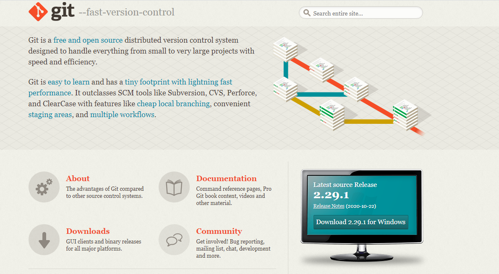
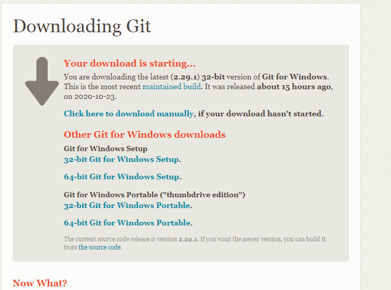
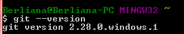
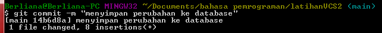
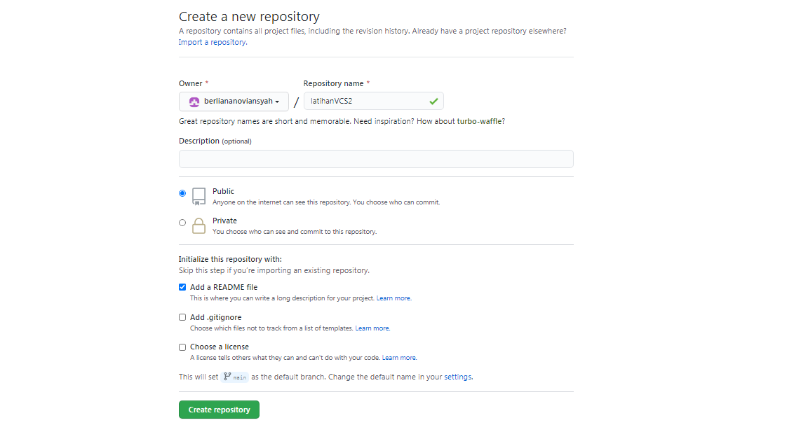

# latihanVCS2

Repository ini dibuat untuk memenuhi tugas Pertemuan 4 Bahasa Pemrograman

Nama : Beriana Noviansyah

NIM : 312010373

Kelas : TI.20.A1

## Langkah-langkah Penggunaan Git

* Langkah pertama Download Git, buka website resminya git [click here](https://git-scm.com/)

* kemudian unduh git sesuai dengan arsitektur komputer kita. unduh sesuai kebutuhan PC anda.

* Git sudah terpasang di windows, untuk mencobanya, silahkan buka cmd atau powershell, kemudian ketik perintah git --version.

## Menambahkan Global config

* Pada saat pertama kali menggunakan git, perlu dilakukan konfigurasi user.name dan user.email

* konfigurasi ini bisa dilakukan global repository atau individual repository

* apabila belum melakukan konfigurasi, akan mengakibatkan terjadi kegagalan saat menjalankan perintah git commit

## Perintah Dasar Git

* Git init, perintah untuk membuat repository local

* "git add ." perintah untuk menyimpan perubahan kedalam database git

* "git commit -m" perintah untuk menyimpan perubahan kedalam database git

* "Git push" perintah untuk mengirim perubahan pada repository local menuju server repository

* Git clone [url], perintah untuk membuat working directory yang diambil dari repository server

* Git remote add origin [url], perintah untuk menambah remote server/repository server pada local repository (working directory)

## Membuat Repository Local

* Buka directory aktif, misal : d:/labs_programan (buka menggunakan Windows Explorer)

* Klik kanan pada directory aktif tersebut, dan pilih menut Git bash, sehingga muncul Git bash, sehingga muncul Git bash command

* Buat directory project praktikum pertama dengan nama latihanVCS2

* Sehingga terbentuk satu directory baru dibawahnya, selanjutnya masuk ke dalam directory tersebut dengan perintah cd (change directory)

* Directory aktif menjadi : d:/labs_pemrograman1/latihanVCS2 $ mkdir latihanVCS2 $ cd latihanVCS

## Membuat repository local 

* Jalankan  perintah git init, untuk membuat repository local.

* Repository baru berhasil di inisialisasi, dengan terbentuk satu directory hidden dengan nama.git

* pada directory tersebut, semua perubahan pada working directory akan disimpan. $ git init

## menambahkan file baru pada repository

* untuk membuat file dapat menggunakan text editor, lalu menyimpan file nya pada direktor aktif (repository)

* disini kita akan coba buat 1 file bernama READme.md (text file)

* `File READme.md berhasil dibuat, $ echo "#latihanVCS2">>READme.md`  

* untuk menambahkan file yang baru saja dibuat tersebut gunakan perintah "git add ."

* File READme.md berhasil ditambahkan. $ git add READme.md

## Commit (Menyimpan perubahan ke database)

* untuk menyimpan perubahan yang ada kedalam database repository local, gunakan perintah git commit -m "komentar commit"

* `perubahan berhasil disimpan. $ git commit -m "update READme.md"`  

## Membuat repository server

* server repository yang akan kita gunakan adalah [click here](http://github.com)

* anda harus membuat akun terlebih dahulu

* pada halaman github, klik ikon start a project, atau dari menu (icon+) klik "New Repository"  

* 

## Menambahkan Remote Repository nya

* Remote repository merupakan server yang akan digunakan untuk menyimpan setiap perubahan pada local repository, sehingga dapat diakses oleh banyak user.

* Untuk menambah remote repository server, gunakan perintah git remote add original [url] $ git remote add origin [click here](https://github.com/berliananoviansyah/latihanVCS2)

